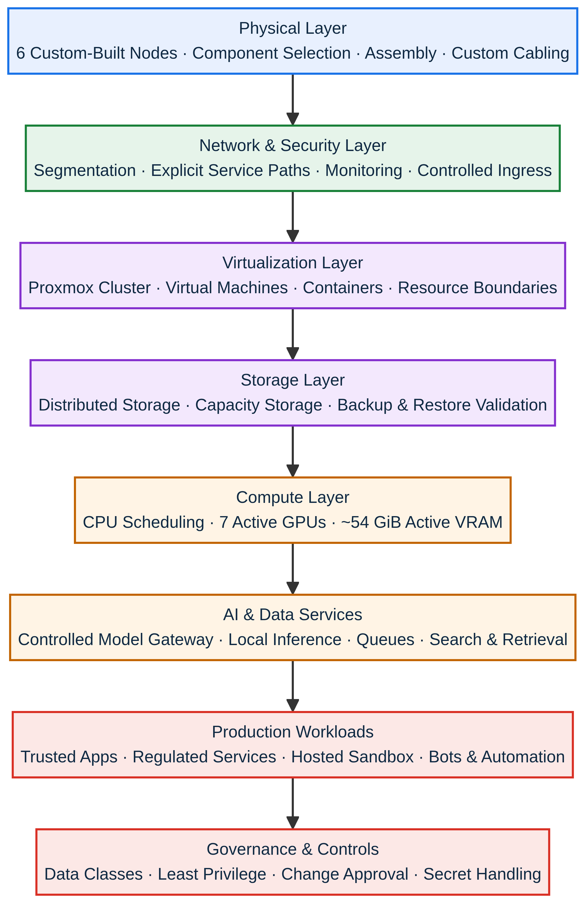
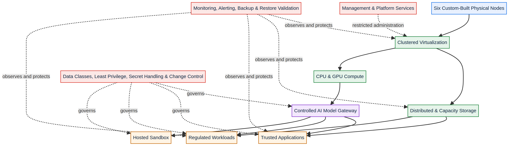

# NemoCluster

## Private AI, Secure Automation, and Regulated-Workload Platform

**NemoCluster** is a six-node private computing platform conceived, selected, assembled, cabled, configured, secured, and operated by **Celso Reic Urbieta**. It supports local AI inference, regulated-workload automation, legal and legislative applications, bots, data services, observability, and controlled self-hosting.

> **Nota em português:** este repositório é um estudo de caso público e sanitizado. Ele não contém endereços, nomes internos, credenciais, topologia operacional, runbooks, comandos de administração ou código de infraestrutura.

## Executive Overview

The project demonstrates end-to-end technical leadership across the entire infrastructure lifecycle: requirements definition, component selection, physical assembly, custom network cabling, cluster design, virtualization, distributed storage, GPU allocation, containerized services, AI orchestration, network segmentation, backups, monitoring, and governance.

The latest documented inventory snapshot, dated **1 September 2026**, records six online physical nodes, approximately 265 GiB of RAM, seven active compute GPUs, approximately 54 GiB of active VRAM, and 15.7 TB of raw storage.[1] These values describe a versioned inventory snapshot rather than a live public telemetry feed.

## From Physical Layer to AI Services

NemoCluster was not assembled from a preconfigured enterprise appliance. The work began with hardware and physical connectivity and progressed through platform architecture and application operations.

| Layer | Ownership and outcome |
|---|---|
| **Physical infrastructure** | Selected components, assembled six machines, installed devices, and produced custom network cabling. |
| **Virtualization** | Built a clustered Proxmox environment for virtual machines, containers, resource isolation, and workload placement. |
| **Storage** | Combined distributed Ceph storage with capacity-oriented network storage and protected backup workflows. |
| **Compute and GPU** | Allocated heterogeneous CPU and GPU resources to AI, automation, data, and application workloads. |
| **AI platform** | Centralized access to local models through a controlled gateway rather than direct service exposure. |
| **Application tiers** | Separated trusted applications, hosted workloads, management, data, and AI services through explicit boundaries. |
| **Operations** | Implemented monitoring, alerting, backups, restore validation, inventory tracking, and controlled changes. |
| **Governance** | Defined data classes, action tiers, secret-handling rules, and human confirmation for sensitive operations. |

## Capacity Snapshot

| Dimension | Documented capacity on 1 September 2026 |
|---|---:|
| Physical nodes | **6 online nodes** |
| CPU | **60 recorded cores** and at least **96 documented threads** |
| Memory | Approximately **265 GiB RAM** |
| Active AI/compute GPUs | **7 discrete GPUs** |
| Active VRAM | Approximately **54 GiB** |
| Raw storage | Approximately **15.7 TB** |
| Distributed storage | **6 Ceph OSDs**, documented healthy in the inventory snapshot |

The calculation method and disclosure limits are described in [`docs/capacity-snapshot.md`](docs/capacity-snapshot.md).[1]

## Sanitized Architecture

The public architecture abstracts the operational environment into eight layers: physical nodes, virtualization, storage, compute, controlled AI access, workload tiers, observability, and governance. Private addresses, hostnames, ports, node affinities, management paths, and recovery commands are omitted.

A detailed public-safe explanation appears in [`docs/architecture.md`](docs/architecture.md). The security and governance rationale is documented in [`docs/security-and-governance.md`](docs/security-and-governance.md).

## Architectural Principles

Proxmox VE provides clustering, virtual machines, containers, storage integration, firewalling, high availability, backup, and related administrative capabilities.[2] Ceph provides distributed object, block, and file-storage concepts built around nodes that replicate and redistribute data.[3] NemoCluster uses these technologies within a custom architecture designed for heterogeneous hardware and local AI workloads.

| Principle | Sanitized implementation pattern |
|---|---|
| **No implicit trust by network location** | Workload tiers and services require explicit access paths rather than broad internal reachability. |
| **Controlled AI access** | Applications obtain model access through a governed gateway rather than connecting directly to inference services. |
| **Data-class separation** | Regulated and confidential data classes are excluded from tiers that do not require them. |
| **Least privilege** | Application containers run without privileged mode, without the Docker socket, and under constrained service identities. |
| **Resilience by verification** | Monitoring, backups, off-site copies, and restore drills are treated as operational controls. |
| **Human control over sensitive actions** | High-impact changes require explicit confirmation and documented execution boundaries. |
| **Secrets outside public source** | Operational credentials remain outside source repositories and public documentation. |

The resource-focused approach is consistent with the central idea of NIST SP 800-207: trust should not be granted solely because an asset is inside a local network, and authentication and authorization should precede access to protected resources.[4] This is an architectural influence, not a certification claim.

## AI Governance

Local inference reduces unnecessary disclosure to external services, but locality alone does not make an AI system trustworthy. NemoCluster therefore combines controlled model access, data-class rules, workload boundaries, logging, human confirmation for sensitive changes, and documented operational responsibilities.

The NIST AI Risk Management Framework describes a voluntary approach for incorporating trustworthiness considerations into the design, development, use, and evaluation of AI systems.[5] NemoCluster’s public governance narrative is aligned to that risk-management intent without claiming formal assessment against the complete framework.

## Leadership and Ownership

Celso Reic Urbieta personally owned the architecture from physical construction through production operations. The work included selecting and assembling each machine, crimping and testing network cables, designing the cluster, configuring virtualization and storage, integrating GPUs, building AI and application tiers, defining security boundaries, and operating the resulting platform.

This case study demonstrates the ability to bridge board-level risk language and hands-on technical execution: **cybersecurity governance, infrastructure architecture, AI risk, capacity planning, service resilience, and regulated-product delivery**.

## Public Portfolio Boundary

This repository contains no executable infrastructure code. It excludes internal addresses, node names, device identifiers, network maps, firewall rules, administrative ports, credentials, secrets, access methods, recovery commands, incident runbooks, client data, application code, configuration values, and source-repository history.

All diagrams are abstractions. They explain architectural reasoning while deliberately preventing reconstruction of the production environment.

## Repository Contents

| Path | Purpose |
|---|---|
| `README.md` | Executive architecture and leadership case study. |
| `docs/architecture.md` | Sanitized layers, trust boundaries, and workload model. |
| `docs/security-and-governance.md` | Public control framework and disclosure boundaries. |
| `docs/capacity-snapshot.md` | Method and limitations for the dated aggregate metrics. |
| `assets/architecture.png` | Sanitized system-flow diagram. |
| `assets/architecture-layers.png` | Layered infrastructure model. |

## Intellectual Property and Responsible Disclosure

The operational platform is proprietary to Nemo Security. This public case study is intended for professional evaluation and grants no license to infrastructure code, configurations, data, models, operational processes, or deployment methods.

Security concerns should be reported privately. Public issues must not contain internal addresses, credentials, configuration excerpts, exploit paths, customer information, or screenshots from operational consoles.

## References

[1]: docs/capacity-snapshot.md "NemoCluster — Sanitized Capacity Snapshot"

[2]: https://pve.proxmox.com/pve-docs/ "Proxmox VE Documentation Index"

[3]: https://docs.ceph.com/en/latest/architecture/ "Ceph Architecture Documentation"

[4]: https://csrc.nist.gov/pubs/sp/800/207/final "NIST SP 800-207 — Zero Trust Architecture"

[5]: https://www.nist.gov/itl/ai-risk-management-framework "NIST AI Risk Management Framework"
