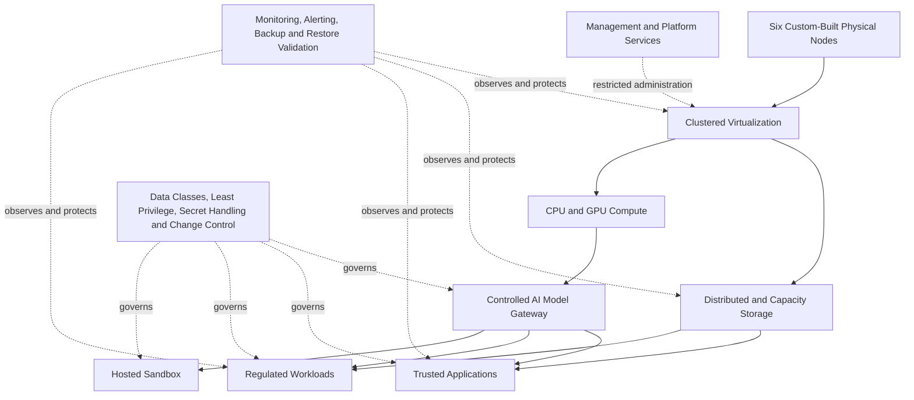

# Sanitized Architecture — NemoCluster

## Design Context

NemoCluster combines heterogeneous commodity hardware, clustered virtualization, distributed storage, GPU-enabled compute, local AI services, and production applications. The architecture was designed to support multiple trust levels without treating the private network as a single trusted zone.

The public model abstracts the environment into layers and policy boundaries. It deliberately excludes internal addresses, hostnames, ports, device identities, workload placement, firewall rules, administrative paths, and recovery procedures.

## Architectural Layers

| Layer | Purpose | Public-safe design description |
|---|---|---|
| **Physical platform** | Supplies compute, memory, storage devices, GPUs, and network connectivity. | Six custom-built machines with heterogeneous resources and tested physical cabling. |
| **Virtualization** | Isolates workloads and allocates resources. | Clustered virtual machines and containers managed through Proxmox VE. |
| **Storage** | Supports distributed and capacity-oriented data services. | Ceph-based distributed storage combined with separate high-capacity storage and backup workflows. |
| **Compute and GPU** | Runs inference, processing, and application workloads. | Resources are assigned according to workload requirements and trust boundaries. |
| **AI access** | Mediates access to local model inference. | Applications use a controlled model gateway instead of direct inference-service exposure. |
| **Application tiers** | Separates trusted, hosted, regulated, and management workloads. | Each tier receives only the network and data access required for its role. |
| **Observability and resilience** | Detects failure and supports recovery. | Health monitoring, alerts, backups, off-site copies, restore validation, and versioned inventory. |
| **Governance** | Controls data classes, secrets, changes, and sensitive actions. | Explicit policies define allowed data, privilege, confirmation requirements, and prohibited operations. |

## Trust Boundaries

The public architecture uses four conceptual workload zones. The **trusted application zone** runs first-party applications that require controlled internet exposure. The **regulated workload zone** handles data or processes requiring stricter governance. The **hosted sandbox zone** isolates less-trusted workloads. The **management and platform zone** remains inaccessible to ordinary applications.

Access between zones is not granted merely because workloads share the same physical cluster. Applications receive explicit paths to required services, and access to AI inference is mediated through a gateway. This approach reflects the resource-focused principle described by NIST SP 800-207, under which location inside a local network does not itself establish trust.[1]

## AI Service Pattern

Local models are exposed through a controlled gateway that centralizes authorization and reduces direct application-to-model coupling. Applications do not receive unrestricted access to orchestration, databases, vector stores, queues, management services, or unrelated workloads.

Data-class policy prevents tiers without a regulated-data requirement from receiving regulated, confidential, or secret classes. Human confirmation is required for sensitive operational changes. These controls support the broader risk-management intent of the NIST AI Risk Management Framework.[2]

## Storage and Resilience Pattern

Ceph provides distributed storage concepts in which nodes cooperate to replicate and redistribute data.[3] NemoCluster uses distributed storage alongside capacity-oriented storage and protected backup workflows. Public documentation does not disclose replication settings, device placement, failure domains, or recovery commands.

Monitoring and backup validation are treated as separate controls. A backup artifact is not assumed recoverable solely because it exists; restore capability is periodically validated in an isolated workflow where appropriate.

## Architecture Diagram Source

The rendered diagram in `assets/architecture.png` is generated from the following public-safe model:

## References

[1]: https://csrc.nist.gov/pubs/sp/800/207/final "NIST SP 800-207 — Zero Trust Architecture"

[2]: https://www.nist.gov/itl/ai-risk-management-framework "NIST AI Risk Management Framework"

[3]: https://docs.ceph.com/en/latest/architecture/ "Ceph Architecture Documentation"
